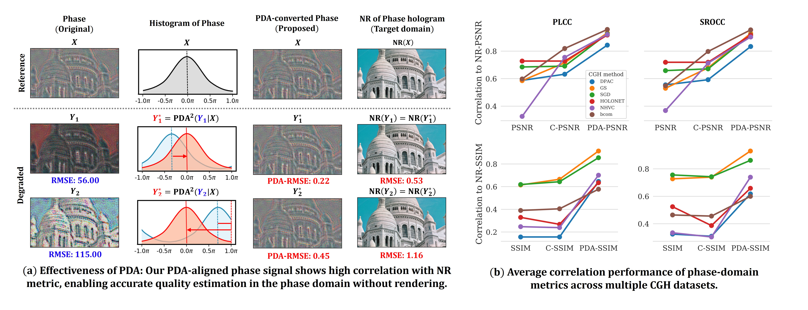
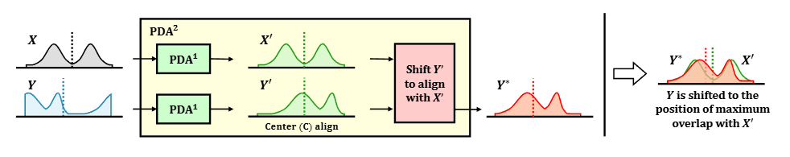
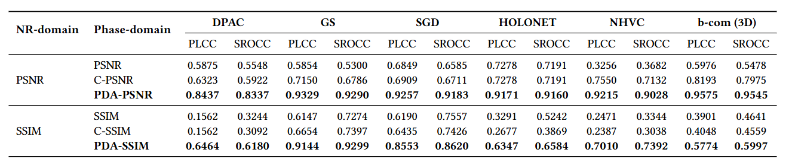

<div align="center">
  <h1>Phase Distribution Alignment (PDA) for Holographic Applications</h1>
  <h4><b>ACM Multimedia 2025</b></h4>

  [**Seungmi Choi**](https://vmlab.khu.ac.kr/members/students/) · [**TaeHwa Lee**](https://vmlab.khu.ac.kr/) · [**Jun Yeong Cha**](https://vmlab.khu.ac.kr/) · [**Suhyun Jo**](https://github.com/rollingman1) · [**Hyunmin Ban**](https://vmlab.khu.ac.kr/) · [**Kwan-Jung Oh**]() · [**Hyunsuk Ko**]() · [**Hui Yong Kim**](https://vmlab.khu.ac.kr/members/professor/)

  <p align="center">
    
  </p>

  [](https://dl.acm.org/doi/10.1145/3746027.3755797)
  [](https://github.com/VML-lambda/Phase-Distribution-Alignment)
  [](https://creativecommons.org/licenses/by-nc-sa/4.0/)

  <p align="center">
    
  </p>

</div>


## Overview

This repository provides the official implementation for the paper:

[**Phase Distribution Matters: On the Importance of Phase Distribution Alignment (PDA) in Holographic Applications**](https://dl.acm.org/doi/10.1145/3746027.3755797)

Phase-only holograms (PoH) encode scene information as a 2π-periodic phase map. Standard image quality metrics (SSIM, PSNR) are not invariant to global phase offsets, producing misleading quality assessments. This repository provides:

- **PDA-SSIM** — Phase Distribution Alignment SSIM
- **PDA-PSNR** — Phase Distribution Alignment PSNR
- **DPI-DB pipeline** — 250 PoH images (50 natural images × 5 CGH methods), 13 distortion types × 5 quality levels
- **Full evaluation pipeline** — phase-domain metric computation, PLCC/SROCC correlation analysis, and visualization


## Key Contributions

1. **PDA-SSIM / PDA-PSNR**: Phase-aware quality metrics that are invariant to global phase offsets via Distribution-Shifting (PDA) correction. Significantly outperform standard SSIM/PSNR and circular variants in correlation with perceptual NR-domain quality.

2. **DPI-DB** (Distortion in Phase Image Database): A dedicated benchmark for holographic phase image quality assessment — 250 reference PoH images across 5 CGH methods, 13 distortion types × 5 quality levels (16,250 distorted images total).


## Method

PDA-SSIM corrects for global phase offset ambiguity (caused by 2π-periodicity) before computing structural similarity. The key steps:

1. **Zero-center**: `x ← x − 128` (map uint8 [0, 255] → [−128, 127])
2. **Double mean removal** with symmetric 256-wrap: removes global phase offset
3. **β-correction**: if `mean(|x|) > 64`, apply an additional 128-shift to resolve ±π ambiguity
4. **Relative alignment**: shift the distorted image toward the reference using their mean difference
5. **Normalize → radian**: `x ← (x + 128) / 255`, then `x ← (1 − x) · 2π − π`
6. **Decompose**: compute `cos(x)` and `sin(x)` channels
7. **Aggregate**: `PDA-SSIM = √( (SSIM_cos² + SSIM_sin²) / 2 )`

PDA-PSNR applies the same steps 1–5 alignment, then computes PSNR on the aligned radian-domain phase maps.




## Installation

```bash
conda create -n pda-holo python=3.9
conda activate pda-holo
pip install -r requirements.txt
```

**Notes:**
- `yuvio` is only required for the HEVC/VVC codec pipeline.
- `torch` / `torchvision` are only required if running PoH generation (ASM propagation).


##  Usage

### Quick Start — PDA Metrics

```python
import numpy as np
from metrics import Metric_SSIM, Metric_PSNR

# Phase images stored as uint8 [0, 255]  ↔  phase [-π, π]
img_ref  = ...  # ndarray, dtype=uint8 or float64
img_dist = ...

# PDA-SSIM (proposed) — phase-aware
ssim_pda = Metric_SSIM['pda'](img_ref.astype(float), img_dist.astype(float))

# PDA-PSNR (proposed) — phase-aware
rmse, psnr_pda, error_map = Metric_PSNR['pda'](img_ref.astype(float), img_dist.astype(float))

# Comparison baselines
ssim_orig = Metric_SSIM['original'](img_ref.astype(float), img_dist.astype(float), data_range=255)
ssim_circ = Metric_SSIM['circular'](img_ref.astype(float), img_dist.astype(float))
```

See `examples/example_pda_metrics.py` for a self-contained runnable demo.

### Available Metrics

| Registry | Key | Description |
|----------|-----|-------------|
| `Metric_SSIM` | `'pda'` | **★ PDA-SSIM** — proposed |
| `Metric_SSIM` | `'original'` | Standard SSIM (Wang 2004) |
| `Metric_SSIM` | `'circular'` | C-SSIM |
| `Metric_PSNR` | `'pda'` | **★ PDA-PSNR** — proposed |
| `Metric_PSNR` | `'original'` | Standard PSNR |
| `Metric_PSNR` | `'circular'` | C-PSNR — (oh2023hevc 2023) |

### DPI-DB Pipeline

#### Step 1. Generate PoH images

> PoH generation uses ASM wave propagation from [Neural Holography](https://github.com/computational-imaging/neural-holography) (Peng et al., SIGGRAPH Asia 2020).

#### Step 2. Apply distortions

```bash
python make_dataset/add_distortion.py \
    --data_path ./data/poh \
    --methods SGD NHVC DPAC GS
```

#### Step 3. Compute phase-domain metrics

```bash
python evaluation/cal_phase_metrics.py \
    --data_path ./data/poh \
    --methods SGD NHVC DPAC GS
```

Output: `{method}/graph_pda/{method}.txt`

#### Step 4. Compute NR-domain metrics

> First reconstruct distorted PoH images via ASM propagation (see [Neural Holography](https://github.com/computational-imaging/neural-holography)) or the generated batch files from `codec/make_bat_eval.py`.

```bash
python evaluation/cal_nr_metrics.py \
    --data_path ./data/poh \
    --methods SGD NHVC DPAC GS
```

Output: `{method}/{method}.txt`

#### Step 5. Correlation analysis

```bash
python evaluation/evaluate.py \
    --data_2d ./data/poh \
    --methods SGD NHVC DPAC GS \
    --out_dir ./results
```

Output: `pcc.txt`, `data.tsv`

#### Step 6. Draw figures

```bash
python evaluation/draw_graph.py \
    --pcc ./results/pcc.txt \
    --data ./results/data.tsv \
    --out_dir ./results
```

Output: `scatter.png`, `catplot_psnr.png`, `catplot_ssim.png`


## Results

PDA-SSIM and PDA-PSNR achieve significantly higher correlation with NR-domain quality scores compared to standard and circular baselines across all CGH methods in DPI-DB.



## Project Structure

```
Phase-Distribution-Alignment/
├── make_dataset/
│   └── add_distortion.py          # 13 distortions × 5 quality levels
│
├── codec/
│   ├── yuv_convert.py             # PNG ↔ YUV444/400 (for HEVC/VVC)
│   ├── make_bat_compress.py       # Generate HEVC/VVC encoding batch files
│   └── make_bat_eval.py           # Generate reconstruction evaluation batch files
│
├── metrics/                       # PDA metrics package
│   ├── __init__.py                # Metric_SSIM, Metric_PSNR registries
│   ├── ssim/
│   │   ├── ssim_original.py       # Standard SSIM (Wang 2004) — 'original'
│   │   ├── ssim_circular.py       # C-SSIM — 256-period circular — 'circular'
│   │   └── ssim_pda.py            # ★ PDA-SSIM (proposed) — 'pda'
│   ├── psnr/
│   │   ├── psnr_original.py       # Standard PSNR — 'original'
│   │   ├── psnr_circular.py       # C-PSNR — 256-period circular — 'circular'
│   │   └── psnr_pda.py            # ★ PDA-PSNR (proposed) — 'pda'
│   └── _utils.py                  # Shared helpers (polar_to_rect, kl)
│
├── evaluation/
│   ├── cal_phase_metrics.py       # Compute phase-domain metrics → {method}/graph_{ver}/
│   ├── cal_nr_metrics.py          # Compute NR-domain metrics → {method}/{method}.txt
│   ├── evaluate.py                # PLCC/SROCC + export pcc.txt / data.tsv
│   └── draw_graph.py              # Scatter + catplots from evaluate.py outputs
│
├── examples/
│   ├── example_pda_metrics.py     # Quick demo: PDA-SSIM / PDA-PSNR
│   └── example_create_dataset.py  # Full DPI-DB pipeline (distort → evaluate → plot)
│
├── requirements.txt
└── README.md
```


## DPI-DB Dataset

**DPI-DB** (Distortion in Phase Image Database) is a phase-hologram quality assessment database built to evaluate phase-domain metrics against perceptual quality in the numerical reconstruction (NR) domain.

Each sample in DPI-DB consists of four images:
1. **Reference natural image** — source scene from DIV2K / Unsplash2K
2. **Reference PoH** — phase-only hologram generated from the natural image via a CGH algorithm
3. **Distorted PoH** — reference PoH with a distortion applied
4. **NR image** — numerical reconstruction (via ASM) of the distorted PoH, used as the perceptual quality reference

### Reference images

- **Natural images**: 50 images selected from [DIV2K](https://ieeexplore.ieee.org/document/8014884) (25) and [Unsplash2K](https://openaccess.thecvf.com/content/CVPR2021W/NTIRE/papers/Kim_Noise_Conditional_Flow_Model_for_Learning_the_Super-Distribution-Alignment_Space_CVPRW_2021_paper.pdf) (25)
- **CGH methods**: GS, SGD, DPAC, HoloNet (NHVC), UNet — 5 methods × 50 images = **250 reference PoH images**
- **Generation parameters**: wavelengths 638 / 520 / 450 nm (R/G/B), propagation distance 20 cm, pixel pitch 6.4 µm

### Distortion types

13 distortion types applied at 5 quality levels each:

| Category | Types |
|----------|-------|
| Common noise (7) | White noise (`wn`), Uniform noise (`un`), Gaussian blur (`gb`), Salt & pepper (`sp`), Global mean shift (`ms`), Contrast change (`cc`), Normalization (`no`) |
| Block-based (3) | Block Gaussian blur (`block_gb`), Block global mean shift (`block_ms`), Block contrast change (`block_cc`) |
| Compression (3) | HEVC (`hevc`), VVC (`vvc`), HEVC for PoH (`hevc2`) |

In total, DPI-DB contains **16,250 distorted PoH images** (250 reference PoH × 13 distortion types × 5 quality levels).

### Evaluation protocol

Each distorted phase image is paired with its **numerical reconstruction (NR)** obtained via Angular Spectrum Method (ASM) propagation. Phase-domain metrics are evaluated by their Pearson Linear Correlation Coefficient (PLCC) and Spearman Rank-Order Correlation Coefficient (SROCC) against NR-domain SSIM and PSNR scores.


## 🔗 Third-Party Code

The ASM (Angular Spectrum Method) wave propagation used for dataset construction is based on **Neural Holography** (Peng et al., SIGGRAPH Asia 2020).

> [GitHub](https://github.com/computational-imaging/neural-holography) — released under [CC BY-NC 4.0](https://creativecommons.org/licenses/by-nc/4.0/)

```bibtex
@article{peng2020neural,
  title     = {Neural Holography with Camera-in-the-loop Training},
  author    = {Peng, Yifan and Choi, Suyeon and Padmanaban, Nitish and Wetzstein, Gordon},
  journal   = {ACM Transactions on Graphics (TOG)},
  volume    = {39},
  number    = {6},
  pages     = {1--14},
  year      = {2020},
  publisher = {ACM New York, NY, USA}
}
```

The circular baseline (C-PSNR / C-SSIM) is based on **HEVC extension for phase hologram compression** (Oh et al., Optics Express 2023).

```bibtex
@article{oh2023hevc,
  title   = {HEVC extension for phase hologram compression},
  author  = {Oh, Kwan-Jung and Ban, Hyunmin and Choi, Seungmi and Ko, Hyunsuk and Kim, Hui Yong},
  journal = {Optics Express},
  volume  = {31},
  number  = {6},
  pages   = {9146--9164},
  year    = {2023},
  doi     = {10.1364/OE.479281}
}
```

## Citation

```bibtex
@inproceedings{choi2025pda,
  title     = {Phase Distribution Matters: On the Importance of Phase Distribution Alignment (PDA) in Holographic Applications},
  booktitle = {Proceedings of the ACM International Conference on Multimedia},
  year      = {2025},
}
```


## Acknowledgements

This work was supported by Samsung Research Funding & Incubation Center of Samsung Electronics under Project Number SRFC-IT2201-03. And this work was partly supported by Institute of Information & communications Technology Planning & Evaluation(IITP) grant funded by the Korea government(MSIT) (No.RS-2022-00155911, Artificial Intelligence Convergence Innovation Human
Resources Development (Kyung Hee University)) for setting up some of computing environments needed for our experiments.


## Contact

For questions or issues, please open a GitHub issue or contact the authors via [vmlab.khu.ac.kr](https://vmlab.khu.ac.kr/).


## License

This work is licensed under a [Creative Commons Attribution-NonCommercial-ShareAlike International 4.0 License](https://creativecommons.org/licenses/by-nc-sa/4.0/).
